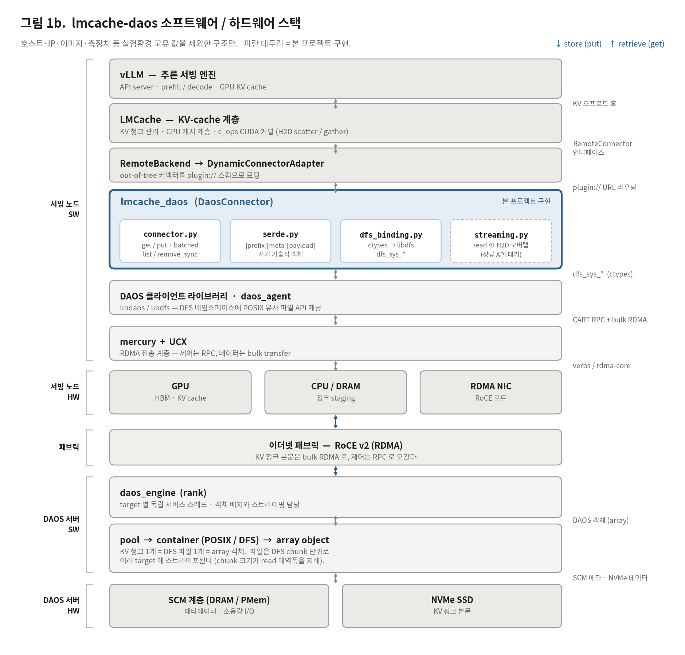

# lmcache-daos

**[LMCache](https://github.com/LMCache/LMCache) 의 KV cache 오프로딩 백엔드를
[DAOS](https://github.com/daos-stack/daos) 로 구현한 out-of-tree 커넥터.**

LMCache 의 `RemoteConnector` 인터페이스에 붙어, vLLM 이 계산한 KV 청크를 DAOS DFS
(`dfs_sys` API) 네임스페이스의 self-describing 파일 하나로 저장한다. dfuse 나 커널
VFS 를 거치지 않고 `libdfs` 를 ctypes 로 직접 호출한다.

vLLM·LMCache 상류를 고치지 않는다 — `plugin://` 스킴과 `remote_storage_plugins`
설정만으로 로드되는 플러그인이다.

## 특징

- **상류 무수정.** vLLM·LMCache 포크나 패치 없이 설정만으로 붙는다.
- **DAOS 네이티브 경로.** `dfs_sys_*` 직접 호출. Samba `vfs_daos` 와 같은 API 계열이다.
- **객체가 자기 자신을 기술한다.** `[prefix 8B][meta][payload]` 한 파일 = KV 청크 하나.
  read 시 별도 stat·index 조회가 없고 외부 메타 DB를 요구하지 않는다. 잘린 객체는
  read 시점에 판정해 miss 로 돌린다(오탐 hit 없음).
- **노드 경계를 넘는 재사용.** 한 노드가 넣은 KV 를 다른 노드가 그대로 hit 한다.
  vLLM 프로세스를 완전히 재시작해도 유지된다.
- **용량 관리 수단.** `list()`(readdir) + `remove_sync()`. `RemoteBackend.remove()` 가
  타는 원격 eviction 경로다(정책 자체는 미구현 — [현황과 한계](#현황과-한계)).
- **batched get/put.** 커넥터 API 수준 GET 2.4–3.5x, PUT 1.3–2.4x.
  `batched_contains` 는 실측 이득이 없어 의도적으로 미구현이다.
- **비블로킹.** blocking libdfs 호출은 스레드풀 executor 로 분리해 LMCache 의 asyncio
  루프를 막지 않는다.
- **튜닝 손잡이 노출.** DFS chunk / oclass / `rd_fac` 로 read 대역폭을 직접 조절한다.

측정 수치와 그 조건, 설계 근거는 [`doc/DESIGN-AND-VALIDATION.md`](doc/DESIGN-AND-VALIDATION.md)
에 있다.

## 동작 방식



```
vLLM ─ LMCache ─ RemoteBackend ─(plugin:// 스킴)─ DaosConnector (connector.py)
                                                   └─ DfsSys ctypes 바인딩 (dfs_binding.py)
                                                        └─ libdfs dfs_sys_* → DAOS Array 객체(파일)
```

- **키 매핑**: `CacheEngineKey` → sha256 → DFS 경로 (flat)
- **객체 레이아웃**: `serde.py` — `[prefix 8B][header][payload]`
- **열거·삭제**: `dfs_sys_opendir/readdir/closedir`, `dfs_sys_remove_type`

## 요구사항

| 항목 | 버전 / 조건 |
|---|---|
| Python | ≥ 3.8 |
| LMCache | **v0.5.2** |
| vLLM | **≥ 0.26.0** |
| DAOS 클라이언트 | 2.8 / 2.9 (`libdaos`, `libdfs`), `daos_agent` 실행 중 |
| DAOS 컨테이너 | `--type POSIX` |
| 백킹 디바이스 | **NVMe 권장** — ZFS zvol 풀에서는 DAOS 로드가 prefill 재계산보다 느려 캐시가 손해다 |

런타임 의존성 패키지는 없다. 시스템 `libdaos`/`libdfs` 를 ctypes 로 열고, LMCache 는
서빙 환경에 이미 있다고 가정한다. 런타임 박스에서 `pip show lmcache vllm` 으로 버전을
먼저 확인할 것 — 버전이 다르면 `connector.py` 의 API 배선과 아래 URL 규칙을 재확인해야
한다.

## 설치

```bash
git clone https://github.com/gluesys/lmcache-daos.git
cd lmcache-daos
pip install .          # 개발 설치는 pip install -e .
```

빌드 산출물이 필요한 컴포넌트는 없다. 순수 파이썬 패키지(`lmcache_daos`,
`lmcache_daos.mp`)이며 C 코드는 아래 선택 항목뿐이다.

**선택 — `daos_event_t` ABI shim.** event queue 경로는 현재 미사용이므로 PoC 에는
필요 없다. 제품화 시에는 구조체 크기를 C 쪽에서 가져오는 편이 안전하다:

```bash
gcc -O2 -fPIC -shared -o libdaos_evshim.so shim/daos_evshim.c -ldaos
export DAOS_EVSHIM_PATH=$PWD/libdaos_evshim.so
```

## 사용법

### 1. DAOS 컨테이너 준비

```bash
daos cont create <pool> <container> \
    --type POSIX --file-oclass=S16 --chunk-size=4194304 --properties=rd_fac:0
```

`--chunk-size=4194304`(**4 MiB**)가 성능의 대부분을 결정한다. 기본 1 MiB 는 per-chunk
RPC 오버헤드로 read 를 크게 떨어뜨린다. 대략 `파일크기 ÷ 랭크당 타깃수` 를 목표로
한다. oclass·복제 계수는 read 성능에 영향이 없었다.

### 2. LMCache 설정

[`examples/lmcache_daos.yaml`](examples/lmcache_daos.yaml) 을 복사해서 쓴다:

```yaml
chunk_size: 256
remote_url: "plugin://daos/<pool>/<container>"
remote_serde: "naive"
remote_storage_plugins: ["daos"]
extra_config:
  remote_storage_plugin.daos.module_path: lmcache_daos.connector
  remote_storage_plugin.daos.class_name: DaosConnector
```

### 3. 실행

```bash
export PYTHONHASHSEED=0                              # 필수 — 아래 참고
export LMCACHE_CONFIG_FILE=examples/lmcache_daos.yaml
vllm serve <model> --kv-transfer-config '{"kv_connector":"LMCacheConnectorV1","kv_role":"kv_both"}'
```

컨테이너 이미지·bind mount·런처를 포함한 실제 기동 예시는
[`deploy/launchers/`](deploy/launchers/) 와 [`deploy/README.md`](deploy/README.md) 에 있다.

### URL 규칙 (중요)

LMCache 는 out-of-tree `RemoteConnector` 를 `DynamicConnectorAdapter` 로 자동 래핑하고,
그 어댑터의 스킴은 `plugin://<plugin_type>` 이며 `can_parse()` 는 `startswith()` 검사다.
따라서:

```
plugin://<plugin_name>/<pool>/<container>[?sys=<sysname>]
```

- **`daos://<pool>/<container>` 는 동작하지 않는다.** 어떤 어댑터에도 매칭되지 않아
  `CreateConnector` 가 `No adapter found for URL: daos://...` 로 실패한다.
- 어댑터는 생성자에 `url` 을 넘기지 않으므로, 커넥터는 대상 pool/container 를
  `config.remote_url` 에서 얻는다.
- 플러그인명은 `{type}` 또는 `{type}.{instance}` 형식이다(`daos.nvme` 처럼 인스턴스
  분리 가능 — 스킴에는 `.` 앞부분만 쓰인다).

### `PYTHONHASHSEED` 고정 (필수)

프로세스·노드 간 캐시 공유에는 `PYTHONHASHSEED` 를 고정해야 한다. LMCache 가 vLLM 의
해시 함수를 못 불러오면 Python builtin `str` hash 로 폴백하고, 이 해시는 프로세스마다
salt 가 달라 **같은 prompt 가 다른 청크 키를 만든다**. 결과적으로 재시작 후 hit 이 0 이
된다. 엔진 기동 **전에** 설정하고, cross-node 구성에서는 모든 노드에 동일 값을 줄 것.

그 밖의 실환경 함정(libdfs 규칙, `DER_NOSPACE`, vLLM 프로세스 누수, FlashInfer JIT 등)은
[`doc/DESIGN-AND-VALIDATION.md`](doc/DESIGN-AND-VALIDATION.md) 의 "운영 주의사항" 절에
정리돼 있다.

## 다른 동작 모드

기본 경로는 vLLM in-process `DaosConnector` 다. 그 밖에:

- **MP(multiprocess) L2 어댑터** — `lmcache_daos/mp/`. 별도 프로세스의 LMCache 캐시
  서버(L1 pinned + DAOS L2)와 vLLM 쪽 `DaosMPConnector`. 여러 vLLM 인스턴스가 한 캐시
  서버를 공유한다. 설계·결과 [`doc/MP-MODE-PLAN.md`](doc/MP-MODE-PLAN.md).
- **GPU-direct in-process 백엔드** — `lmcache_daos/gds_backend.py`. `dfs_read_gpu`/
  `dfs_write_gpu` 로 DAOS ↔ GPU 메모리를 직접 오간다. DAOS·UCX·Mercury·libfabric 패치가
  필요하다: [`gpudirect/README.md`](gpudirect/README.md).
- **completion-ordered 스트리밍** — `lmcache_daos/streaming.py`. `read ⊕ H2D` 직렬
  합성을 겹쳐 1.55x. 서빙 반영은 LMCache 상류에 streaming API 가 열려야 한다.

## 테스트

DAOS 없이 (serde 프레이밍 로직):

```bash
python3 tests/test_serde.py
```

DAOS 가 있는 박스에서:

```bash
daos cont create <pool> <cont> --type POSIX
export DAOS_TEST_POOL=<pool> DAOS_TEST_CONT=<cont>

python3 tests/test_dfs_roundtrip.py        # T1  DFS 왕복 (LMCache 불필요)
python3 tests/test_connector_roundtrip.py  # T2  커넥터 왕복
python3 tests/test_plugin_routing.py       # T3  플러그인 라우팅 + daos:// 거부
python3 tests/test_partial_object.py       # T4  잘린 객체 → 오탐 hit 없음
python3 tests/test_concurrent_writers.py   # T5  동일 키 동시 writer
python3 tests/test_list_and_remove.py      # T7  list() + remove_sync()
python3 tests/test_batched.py              # T8  batched_get / batched_put
python3 tests/test_manyread.py             #     무결성 재현기 (28 MB × 30)
```

T2~T5 는 멱등하다 — 시작 시 대상 키를 제거하므로 반복 실행할 수 있다.

GPU + vLLM 이 있는 박스에서 (E2E):

```bash
POOL=<pool> CONT=<cont> bash tests/phase3_vllm_e2e.sh       # miss → store → 재시작 → hit
POOL=<pool> CONT=<cont> bash tests/phase3_multi_replica.sh  # replica 2개가 공유 L2 재사용
```

마이크로벤치와 클라이언트측 측정 하네스는 각각 `tests/bench_*.py` 와
[`bench/README.md`](bench/README.md) 에 있다.

## 저장소 구조

```
lmcache_daos/     커넥터 본체 (connector / dfs_binding / serde / streaming / gds_backend)
                    mp/  LMCache MP 모드용 L2 어댑터 + vLLM 커넥터
shim/             daos_evshim.c — sizeof(daos_event_t) 를 C 쪽에 두는 선택적 shim
examples/         LMCache 설정 예시
tests/            게이트 테스트 + 마이크로벤치 (DAOS 필요)
bench/            클라이언트측 측정 하네스 (vLLM+LMCache E2E)
deploy/           환경 재구성 — 런처·Containerfile·설정·호스트 스냅샷
gpudirect/        dfs_*_gpu() 스택 — DAOS/UCX/Mercury 패치와 3단 검증 도구
doc/              설계·검증 기록, 그림, 상류 제출 초안
```

## 문서

| 문서 | 내용 |
|---|---|
| [`doc/DESIGN-AND-VALIDATION.md`](doc/DESIGN-AND-VALIDATION.md) | **전체 기록** — 설계 근거, 실측 검증 결과, 운영 주의사항, 미해결 지점 |
| [`deploy/README.md`](deploy/README.md) | 환경 재구성 가이드 + 측정 전 체크리스트 (모르면 결과가 조용히 무효가 된다) |
| [`gpudirect/README.md`](gpudirect/README.md) | GPU-direct 스택의 패치와 검증 절차 |
| [`doc/MP-MODE-PLAN.md`](doc/MP-MODE-PLAN.md) | MP 모드 L2 어댑터 설계·결과 |
| [`doc/MP-VS-HUB-BENCHMARK.md`](doc/MP-VS-HUB-BENCHMARK.md) | MP 모드 vs 기존 벤치마크 재측정 |
| [`doc/lmcache-mp-l2-assessment.md`](doc/lmcache-mp-l2-assessment.md) | LMCache MP 모드 L2 어댑터 평가 |
| [`doc/upstream/`](doc/upstream/) | 상류(libfabric / LMCache / DAOS)에 제출할 초안 |
| [`bench/README.md`](bench/README.md) | 측정 하네스 색인과 판정 기준 |

## 현황과 한계

기능·정합성 게이트(T0–T8, Phase 3)는 전부 PASS 이고 cross-node 공유까지 검증됐다.
남은 것:

- **용량 정책이 없다.** `list()`/`remove_sync()` 로 수단은 갖췄지만 무엇을 언제 지울지는
  미정이다. 그대로 두면 컨테이너가 단조 증가한다.
- **`list()` 가 돌려주는 이름은 `CacheEngineKey` 로 되돌릴 수 없다.** `_key_to_path` 가
  sha256 해싱이라 64자 다이제스트가 나온다. 용량 작업에는 충분하지만 이름에서 키를
  복원하는 소비자에는 못 쓴다.
- **`put()` 이 드물게 `EINVAL`.** 여러 핸들이 같은 부모 디렉터리에 동시 create 할 때
  발생한다(10회 × 16스레드에서 1/160). 재시도는 아직 없다.
- **retrieve 상한은 `read ⊕ H2D` 직렬 합성**이다. 스트리밍으로 1.55x 를 확보했지만
  서빙 반영은 LMCache 상류 API 대기 중이다.
- 다중 클라이언트 메타데이터 경합, rank 증설 시 선형 확장성은 미측정.

전체 목록과 각 항목의 근거는
[`doc/DESIGN-AND-VALIDATION.md`](doc/DESIGN-AND-VALIDATION.md) 의 "알려진 미해결 지점"
절에 있다.

## 기여

이 저장소는 사내 GitLab(`exastor/lmcache-daos`)이 상류이고, `main` 은 GitHub
[`gluesys/lmcache-daos`](https://github.com/gluesys/lmcache-daos) 로 push mirror 된다.
**GitHub 쪽에 직접 푸시하지 말 것** — 미러가 덮어쓴다.

문서에 나오는 IP 주소는 모두 문서용 대역(RFC 5737 / RFC 2544)으로 치환돼 있다. 호스트
suffix 는 원본과 같아 문서 안의 상호 참조는 그대로 유효하다.
