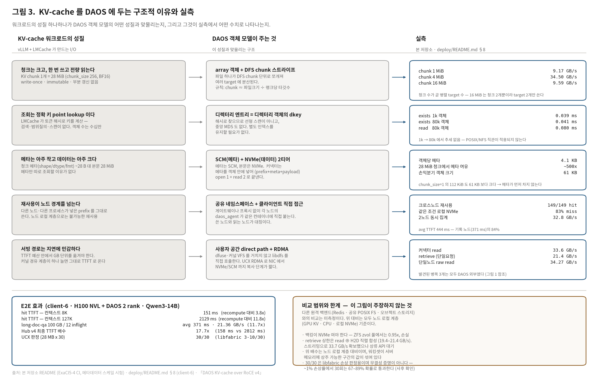

# lmcache-daos

LMCache의 KV cache 오프로딩 백엔드를 **DAOS**로 구현하는 프로젝트.
LMCache의 `RemoteConnector` 인터페이스에 커넥터를 붙여, KV 청크를
DAOS DFS(`dfs_sys` API) 네임스페이스의 self-describing 파일로 저장한다.

## 주요 특징과 강점

수치에는 출처를 달았다. `ExaCI5-4` = A2 1장 + DAOS 4 rank CI(Qwen3-1.7B, 아래
[검증 결과](#검증-결과-2026-07-30-exaci5-4-ci)), `client-6` = H100 NVL + DAOS 2 rank
테스트베드(Qwen3-14B, [`deploy/README.md`](deploy/README.md) §8). 두 환경은 prefill
연산량이 크게 달라 배수를 섞어 읽으면 안 된다.

### 특징

- **LMCache 상류를 고치지 않는다.** `plugin://` 스킴과 `remote_storage_plugins` 설정만
  으로 로드되는 out-of-tree `RemoteConnector` 구현이다. vLLM·LMCache 포크나 패치가
  필요 없다 ([플러그인 등록과 URL 규칙](#플러그인-등록과-url-규칙-중요)).
- **DAOS 네이티브 경로.** dfuse나 커널 VFS를 거치지 않고 `libdfs`의 `dfs_sys_*` 를
  ctypes로 직접 호출한다. Samba `vfs_daos` 와 같은 API 계열이라 호출 패턴이 검증돼 있다.
- **객체가 자기 자신을 기술한다.** `[prefix 8B][meta][payload]` 한 파일 = KV 청크 하나.
  read 시 별도 stat·index 조회가 없고, 외부 인덱스나 별도 메타 DB를 요구하지 않는다.
- **용량 관리 수단이 있다.** `list()`(readdir) + `remove_sync()`(`remove_type`). 이것이
  `RemoteBackend.remove()`가 타는 원격 eviction의 유일한 경로다 (정책 자체는 미정 —
  [알려진 미해결 지점](#알려진-미해결-지점)).
- **batched get/put.** 커넥터 API 수준에서 GET 2.4–3.5x, PUT 1.3–2.4x
  (`ExaCI5-4`). `batched_contains`는 실측 이득이 없어 **의도적으로 미구현**이다.
- **스토리지 쪽 튜닝 손잡이가 노출된다.** DFS chunk / oclass / `rd_fac` 로 read 대역폭을
  직접 조절한다. chunk 1 MiB → 4 MiB 하나로 sustained read 9.2 → 34.5 GB/s (`client-6`).
- **비블로킹.** blocking libdfs 호출은 스레드풀 executor로 분리해 LMCache의 asyncio
  루프를 막지 않는다.

### 이 커넥터가 만든 것 (측정으로 확인)

여기 있는 것들은 **커넥터 코드에 귀속되는 것**만이다. 아래 [DAOS 계층에서 오는
것](#daos-를-kv-계층으로-골라서-얻는-것)과 구분해서 읽을 것.

- **잘린 객체를 hit 으로 오탐하지 않는다.** 8 B prefix 길이 프레이밍으로 부분 저장을
  read 시점에 판정한다. 초기 구현은 예외가 서빙 경로로 탈출했고, 6개 절단 지점
  시험(T4)으로 잡아 miss 반환으로 고쳤다. 같은 키에 동시 writer 40라운드 x 6 writer
  에서 blend 없음(T5).
- **read 한 번으로 끝난다.** 객체가 자기 자신을 기술하므로 stat·index 왕복이 없다.
  커넥터 read 실측 33.6 GB/s (2.07 GB / 62 ms, `client-6`).
- **용량 관리 경로를 만들었다.** 그 전에는 `list()` 가 `[]` 를 돌려주고 삭제 경로가 아예
  없어 컨테이너가 단조 증가만 했다 (T7).
- **retrieve 상한의 정체를 규명하고 그 위로 올라갔다.** 21.4 GB/s 가 `read ⊕ H2D`
  **직렬 합성**임을 모델 오차 0.1% 로 규명하고, completion-ordered 스트리밍으로
  33.7 GB/s(**1.55x**)를 확보했다 (`lmcache_daos/streaming.py` — 서빙 반영은 LMCache
  상류 API 대기).
- **플러그인 라우팅 계약을 실동작으로 확정했다.** `daos://` 는 어떤 어댑터에도 매칭되지
  않아 실패한다는 것을 찾아 `plugin://<pool>/<container>` 규칙으로 고쳤다 (T3).
- **DFS chunk 규칙을 찾았다.** `chunk ≈ 파일크기 ÷ 랭크당 타깃수`. 1 MiB → 4 MiB 로
  sustained read 9.2 → 34.5 GB/s 이고, 16 MiB 붕괴(9.6)까지 같은 규칙으로 설명된다.
  oclass·복제·스트라이프 폭은 read 에 거의 무영향이었다.
- **안 만든 것에도 근거가 있다.** batched get/put 은 구현했고(커넥터 API 수준 GET
  2.4–3.5x, PUT 1.3–2.4x), `batched_contains` 는 순차 프로빙 8.8 ms vs fan-out 9.4 ms
  로 이득이 없어 미구현이다. 디렉터리 fanout 도 측정 결과 불필요로 결론했다.

부수 산출물 — 커넥터의 강점이 아니라 이 작업이 찾아낸 **DAOS 측 수정 사항**이다:
libfabric `verbs;ofi_rxm` 이 대용량 RDMA read 를 조용히 손상시킨다는 것(28 MB x 30 중
3–10개만 정상, raw verbs 는 무결), 그리고 UCX 활성화의 실제 관문이 재빌드가 아니라
패키징에서 빠진 `libna_plugin_ucx.so` 라는 것.

⚠️ 이때 UCX 쪽 **"30/30 통과"는 무결성의 증거가 아니었다.** 이후 밝혀진 DAOS 읽기
손상률(1% 내외)에서 30회 시행은 67–89% 확률로 그냥 통과한다
([`gpudirect/DAOS-CONCURRENT-READ-CORRUPTION.md`](gpudirect/DAOS-CONCURRENT-READ-CORRUPTION.md)
§13.6). libfabric 이 그보다 훨씬 심하게 깨진다는 판정에는 여전히 쓸 수 있지만,
UCX 경로가 깨끗하다는 근거로는 쓸 수 없다.

### DAOS 를 KV 계층으로 골라서 얻는 것

> **lmcache-daos 고유 강점이 아니다.** 원격·공유 계층이면 원리상 얻는 이점이고,
> 커넥터의 역할은 DAOS 에서 그것이 *실제로 성립하게* 만든 것뿐이다. 노드 로컬 계층
> 대비는 아래처럼 실측했지만, 다른 원격 백엔드(Redis / 공유 POSIX FS / 오브젝트
> 스토리지) 와의 비교는 **미측정**이다.



워크로드의 성질 → 그것과 맞물리는 DAOS 객체 모델의 구조 → 실측 수치를 한 줄씩 짝지은
그림이다. 아래 항목들의 근거가 어디서 온 것인지 이 그림 하나로 따라갈 수 있다.

- **prefill 재계산 제거.** hit TTFT 는 컨텍스트 8K 에서 151 ms, 127K 에서 2129 ms 이고
  같은 컨텍스트의 recompute 대비 3.8x → 11.8x. 100 GB long-doc-qa / 12 inflight 에서
  avg TTFT 371 ms, 집계 21.36 GB/s (recompute 대비 11.7x) — `client-6`. Hub v4 기준
  최종 TTFT 배수는 17.7x (hit 158 ms vs recompute 2812 ms).
- **노드 경계를 넘는 재사용.** 한 번도 KV 를 쓴 적 없는 노드가 다른 노드가 넣은
  100 GB KV 를 **149/149 전량 히트**(미스 0), avg TTFT 444 ms 로 기록 노드(371 ms)의
  84%. 같은 조건의 **로컬 NVMe 는 83% 미스** — 노드 로컬 계층으로는 구조적으로 불가능한
  재사용이다 (`client-6`). 여기서 DAOS 대신 다른 공유 백엔드를 써도 공유 자체는 된다;
  갈리는 것은 대역폭·용량·운영 비용이고 그 비교는 하지 않았다.
- **재시작·프로세스 교체 내성.** vLLM 을 완전히 재시작해 GPU KV 와 LMCache 로컬 CPU
  계층을 모두 비운 뒤에도 전량 hit — 2차 패스의 hit 출처는 DAOS 뿐이다 (`ExaCI5-4`,
  Phase 3). 독립 replica 간 공유도 cross-replica 2.75x (T6).
- **대역폭.** 단일 노드 raw read 34.27 GB/s(100 GB NVMe 상주), 2노드 동시 집계
  32.8 GB/s, 단일요청 retrieve 21.4 GB/s (`client-6`). 2노드 집계가 2배로 가지 않는
  이유까지 규명돼 있다 — 병목이 클라이언트에서 서버로 넘어간 구간이다.
- **메타데이터 여유.** 실제 청크 크기(28 MiB)에서 메타는 제약의 약 500배 밖이고,
  손익분기 객체 크기 61 KB 는 `chunk_size=1`(112 KiB) 보다도 작다. 이는 DAOS 풀의 티어
  비율에서 오는 성질이며, 커넥터가 여기서 얻은 것은 *flat(`/` + sha256) 키매핑을 유지해도
  된다는 근거* 뿐이다.

### 적용 조건 (강점이 성립하는 범위)

- **백킹은 NVMe 여야 한다.** ZFS zvol 풀에서는 DAOS 로드가 prefill 재계산보다 느려
  0.95x(**손실**), NVMe 풀에서 2.63–2.81x (`ExaCI5-4`). 지연이 중요한 시험은 NVMe
  백킹 풀로.
- **retrieve 상한은 `read ⊕ H2D` 직렬 합성**이다. 커넥터 read 33.6 + c_ops H2D 45.8
  → 합성 19.4 GB/s. completion-ordered 스트리밍으로 33.7 GB/s(1.55x)를 확보했지만
  실제 서빙 반영은 **LMCache 상류에 streaming API 가 열려야** 한다.
- 성능은 이미지·설정에 민감하다. `lmcache.c_ops` 비활성(이미지 CUDA 불일치)만으로
  retrieve 가 6x 느려지고, 긴 프롬프트를 텍스트로 보내면 API 서버 GIL 직렬화가 TTFT 를
  4.2x 왜곡한다. 측정 전 체크리스트는 [`deploy/README.md`](deploy/README.md) §7 에 있다.
- 프로세스·노드 간 공유에는 **`PYTHONHASHSEED` 고정이 필수**다
  ([운영 주의사항](#운영-주의사항-실측-기반)).
- 남은 미해결 지점(용량 정책 부재, `list()` 이름의 키 복원 불가, 드문 `put()` EINVAL
  등)은 [알려진 미해결 지점](#알려진-미해결-지점)에 그대로 적어 두었다.

## 아키텍처


각 계층의 역할과 계층 간에 넘는 인터페이스만 담은 그림이다. 실험환경 고유 값
(호스트·IP·이미지·측정치)이 들어간 판과 테스트베드 토폴로지는
[`doc/figures/`](doc/figures/) 에 함께 있다 (`fig1`, `fig2`).

호출 경로만 요약하면:

```
vLLM ─ LMCache ─ RemoteBackend ─(plugin:// 스킴)─ DaosConnector (connector.py)
                                                   └─ DfsSys ctypes 바인딩 (dfs_binding.py)
                                                        └─ libdfs dfs_sys_* → DAOS Array 객체(파일)
```

- **키 매핑**: `CacheEngineKey` → `sha256` → DFS 경로 (flat, fanout은 Phase 4)
- **객체 레이아웃**: `serde.py` — `[prefix 8B][header][payload]`. 파일이 자기 자신을
  기술하므로 read 시 별도 stat/index 불필요.
- **동시성**: blocking libdfs 호출은 스레드풀 executor로 분리해 asyncio 루프 비블로킹.
- **열거·삭제**: `list()`는 `dfs_sys_opendir/readdir/closedir`, `remove_sync()`는
  `dfs_sys_remove_type`. `RemoteBackend.remove()`가 `remove_sync()`를 호출하므로
  이것이 원격 eviction의 유일한 경로다.

## 저장소 구조

```
lmcache_daos/     커넥터 본체 (connector / dfs_binding / serde / streaming)
                    streaming.py  completion-ordered 스트리밍 — 1.55× 오버랩
                    daos_event.py DAOS event queue 바인딩 ※ 미사용, 아래 주의
shim/             daos_evshim.c — sizeof(daos_event_t) 를 C 쪽에 두는 선택적 shim
tests/            게이트 테스트 + 마이크로벤치 (DAOS 필요)
bench/            클라이언트측 측정 하네스 (vLLM+LMCache E2E)
deploy/           ★ 환경 재구성 — 런처·Containerfile·설정·호스트 스냅샷
gpudirect/        dfs_*_gpu() 스택 — DAOS/UCX/Mercury 패치와 3단 검증 도구
doc/              그림(figures/)과 상류 조사 문서
                    lmcache-mp-l2-assessment.md  LMCache MP 모드 L2 어댑터 평가
```

**환경을 다시 세우려면 [`deploy/README.md`](deploy/README.md) 를 먼저 읽을 것.**
측정에 쓴 호스트(client-6)가 반납되었으므로, 토폴로지·풀/컨테이너 속성·`daoslib-ucx`
큐레이션·컨테이너 2단 빌드, 그리고 *모르면 결과가 조용히 무효가 되는* 측정 체크리스트가
그 문서에만 있다.

이 커넥터는 CPU `MemoryObj` 를 반환하는 `RemoteConnector` 계약 위에 있어 GPU-direct 가
아니다. GPU 버퍼에 직접 read/write 하는 DAOS 쪽 데이터 평면은 별도로 세웠고, 그 패치와
검증 절차는 [`gpudirect/README.md`](gpudirect/README.md) 에 있다 (정합성 통과, 성능 미측정).

## 근거 (검증된 사실)

- DAOS **2.9.100** 소스: `daos/src/include/daos_fs_sys.h`
  (`dfs_sys_connect/_open/_read/_write/_close/_remove`), `daos_fs.h` (플래그).
- Samba **vfs_daos** 모듈이 동일하게 `dfs_sys` API 사용 → 호출 패턴 재사용.
- LMCache `RemoteConnector` 인터페이스: `async exists / exists_sync / async get /
  async put / async list / async close`, 키 타입 `CacheEngineKey`
  (`lmcache/v1/storage_backend/connector/base_connector.py`).

## 대상 버전 핀

**LMCache v0.5.2 + vLLM ≥ 0.26.0** 기준으로 구현·검증. LMCache v0.5.2 릴리스 노트가
"Requires LMCache v0.5.2 for vLLM ≥ 0.26.0"으로 명시한다. 런타임 박스에서
`pip show lmcache vllm`으로 확인 후 진행할 것. 버전이 다르면 `connector.py`의 API
배선과 아래 플러그인 URL 규칙을 재확인해야 한다.

## 플러그인 등록과 URL 규칙 (중요)

LMCache는 out-of-tree `RemoteConnector` 서브클래스를 `DynamicConnectorAdapter`로
자동 래핑한다. **실측한 계약은 다음과 같고, `daos://` 스킴은 동작하지 않는다.**

```python
# lmcache/v1/storage_backend/connector/__init__.py
schema = "plugin://%s" % extract_plugin_type(plugin_name)   # "plugin://daos"
def can_parse(self, url): return url.startswith(self.schema)  # startswith!
def create_connector(self, context):
    return self._connector_class(
        loop=..., local_cpu_backend=..., config=...)          # url 인자 없음
```

1. **스킴은 `plugin://`** — `daos://<pool>/<container>`는 어떤 어댑터에도 매칭되지
   않아 `CreateConnector`가 `No adapter found for URL: daos://...`로 실패한다.
   `can_parse`가 `startswith`이므로 pool/container를 path에 실어 보낼 수 있다:

   ```
   plugin://<plugin_name>/<pool>/<container>[?sys=<sysname>]
   ```

2. **생성자는 `url`을 받지 않고 `config`를 받는다** — 따라서 커넥터는 대상 pool/
   container를 `config.remote_url`에서 얻는다. `DaosConnector.__init__`은
   `(url=None, loop=None, local_cpu_backend=None, config=None)` 형태로, 어댑터 경유
   호출과 직접 생성(테스트) 양쪽을 모두 지원한다.

3. **플러그인명 형식은 `{type}` 또는 `{type}.{instance}`** — `extract_plugin_type`이
   `.` 앞부분만 스킴에 쓰므로 `daos.nvme` 같은 인스턴스 분리가 가능하다.

설정 예시는 `examples/lmcache_daos.yaml` 참고.

```yaml
chunk_size: 256
remote_url: "plugin://daos/hdd_pool/lmcache_test"
remote_serde: "naive"
remote_storage_plugins: ["daos"]
extra_config:
  remote_storage_plugin.daos.module_path: lmcache_daos.connector
  remote_storage_plugin.daos.class_name: DaosConnector
```

## 진행 상태

- [x] **Phase 0** 환경 조사 — 개발 박스엔 DAOS 런타임/LMCache 미설치. 실제 I/O는
      런타임 박스에서 (pool/POSIX 컨테이너 필요).
- [x] **Phase 1** libdfs ctypes 바인딩 + serde 프레이밍 + 단위테스트.
      **T1(DFS roundtrip) 실 DAOS 환경 PASS.**
- [x] **Phase 2 (코드)** 실제 LMCache v0.5.2 API로 커넥터 확정:
      `RemoteMetadata` 메타 코덱, `local_cpu_backend.allocate(...)` 재구성,
      플러그인 등록 방식.
- [x] **Phase 2 (검증)** **T2 커넥터 왕복 PASS** (LocalCPUBackend→put→exists→get,
      payload/shape/dtype 일치).
- [x] **Phase 2 잔여** 플러그인 스킴 라우팅 **실동작 확인 완료** — `daos://`가
      실제로 라우팅되지 않는 결함을 발견해 `plugin://` 규칙으로 수정.
      **T3(플러그인 라우팅) PASS.**
- [x] **Phase 3** vLLM+LMCache **miss→store→hit PASS** (아래 검증 결과 참고).
- [x] **Phase 3 정합성** 부분 저장 청크의 오탐 hit 방지 **PASS** — 잘린 객체에서
      예외가 서빙 경로로 탈출하던 결함을 발견해 miss 반환으로 수정 (T4).
      동일 키 동시 writer 경합 **PASS** (T5).
- [x] **Phase 3 멀티 replica** 독립 vLLM replica 2개가 공유 DAOS L2로 prefill 생략
      **PASS**, 동시 read 확장성 측정 완료 (T6).
- [x] **Phase 3 잔여 — 진짜 cross-node 공유 PASS.** H100 노드 2대(client-6/-7)로
      재측정. 한 번도 쓴 적 없는 노드가 다른 노드가 넣은 **100 GB KV 를 149/149 전량
      히트**(미스 0), avg TTFT 444 ms — 기록 노드(371 ms)의 84%. 같은 조건의 local
      NVMe 는 83% 미스로, 구조적으로 공유가 불가능하다는 것도 함께 확인.
- [x] **용량 관리 기반** `list()`(readdir) + `remove_sync()` 구현 **PASS** (T7).
      이전에는 `list()`가 `[]`이고 삭제 경로가 아예 없어 컨테이너가 단조 증가만 했다.
- [ ] **용량 정책** eviction/TTL/모델 revision 폐기 정책 설계. 32K prefix 하나가
      ~3.5 GiB, 64K는 ~7 GiB이므로 `nvme_pool`(7.5 GB)은 32K 2개면 찬다.
- [x] **batched 인터페이스** `batched_get`/`batched_put` 구현 **PASS** (T8).
      `batched_contains`는 측정 결과 이득이 없어 의도적으로 상속 유지 (아래 참고).
- [x] **메타데이터 스케일 시험** 완료 — **디렉터리 fanout은 불필요**하다는 결론
      (`tests/bench_metadata_scale.py`, 아래 절 참고). 메타를 근거로 한 dkey/akey
      투자도 정당화되지 않는다.
- [x] **Phase 4** 벤치·튜닝 완료. 결정적이었던 것은 **DFS chunk 4 MiB**(read
      9 → 34.5 GB/s)이고 oclass·복제는 무영향. RDMA 는 **UCX** 로 확정 — libfabric
      `verbs;ofi_rxm` 이 대용량 read 를 조용히 손상시킨다(30개 중 3–10개만 정상,
      raw verbs 는 무결). 활성화 관문은 재빌드가 아니라 누락된 `libna_plugin_ucx.so`.
- [x] **Phase 4+ retrieve 파이프라인** 상한 21.4 GB/s 가 `read ⊕ H2D` **직렬 합성**
      임을 규명(모델 오차 0.1%)하고, completion-ordered 스트리밍으로 **33.7 GB/s
      (1.55×)** 확보 — `lmcache_daos/streaming.py`. 실제 서빙 반영은 **LMCache 상류에
      streaming API 가 열려야** 한다(RFC 제출 대기).
- [ ] **Phase 5** eviction/용량관리, SRPM/CI 연계, 문서·HA.

측정 수치의 전체·정정 이력은 [`deploy/README.md`](deploy/README.md) §8 의 Hub 문서 링크 참조.

## 검증 결과 (2026-07-30, ExaCI5-4 CI)

환경: 클라 192.168.35.40 (Rocky 8.10, NVIDIA A2 15356MiB, 드라이버 610.43.02,
CUDA 13.3, torch 2.11.0+cu130) / DAOS 2.9.100 서버 4 rank (.41 rank0·1, .42 rank2·3,
`ofi+verbs;ofi_rxm` on ib0 172.30.44.0/24) / vLLM 0.26.0 + LMCache 0.5.2 /
모델 Qwen3-1.7B.

### 기능 검증

| 테스트 | 내용 | 결과 |
|---|---|---|
| T0 | serde 프레이밍 (DAOS 불필요) | PASS |
| T1 | DFS roundtrip, 1 MiB write/read/remove | PASS |
| T2 | 커넥터 왕복 (직접 생성) | PASS |
| T3 | 플러그인 라우팅 (`CreateConnector` 경유) + `daos://` 거부 | PASS |
| T4 | 부분 저장(잘린) 객체 6개 절단 지점 → 오탐 hit 없이 miss | PASS |
| T5 | 동일 키 동시 writer 40라운드 × 6 writer, blend 검출 | PASS |
| T6 | 독립 replica 2개의 공유 L2 재사용 + 동시 read | PASS |
| T7 | `list()` 열거 + `remove_sync()` 삭제 (플러그인 래퍼 경유 포함) | PASS |
| T8 | `batched_get`/`batched_put` + 상속된 prefix 의미 | PASS |
| Phase 3 | vLLM miss→store(DAOS)→**프로세스 재시작**→hit(DAOS) | PASS |

Phase 3은 두 패스 사이에 vLLM을 완전히 재시작한다. GPU KV 캐시와 LMCache 로컬 CPU
계층이 모두 비워지므로, 2차 패스의 hit 출처는 DAOS뿐이다.

```
pass1: Stored 2048+2048+768 = 4864 tokens (0.5195 GB)
pass2: LMCache hit tokens: 4864, need to load: 4864     ← 전량 hit
       Retrieved 4864 out of 4864 required tokens. size: 0.5195 gb,
                cost 501.7759 ms, throughput: 1.0354 GB/s
       DAOS 파일 수·바이트 불변 → 재계산·재저장 없음
```

### 성능: 저장 계층이 손익분기를 가른다

풀만 바꾸고 나머지 조건을 고정한 실측. hit 토큰 수와 키 해시는 양쪽 동일.

| pool | 백킹 디바이스 | TTFT cold | TTFT warm | 결과 |
|---|---|---|---|---|
| `hdd_pool` | ZFS zvol (`/dev/zvol/daoshdd/daosdata`) | 2.035s | 2.147s | **0.95x — 손실** |
| `nvme_pool` | kdev NVMe | 1.986s | **0.706s** | **2.81x (TTFT 64.5%↓)** |
| `nvme_pool` (재현) | kdev NVMe | 1.781s | **0.678s** | **2.63x (TTFT 61.9%↓)** |

NVMe 결과는 독립 실행에서 2.63~2.81x로 재현된다.

NVMe 계층에서는 DAOS 로드 0.50s < prefill 재계산 1.99s로 손익분기 부등식이 성립한다.
zvol 계층에서는 로드가 prefill보다 느려 캐시가 오히려 손해다. **지연이 중요한 시험은
NVMe 백킹 풀을 쓸 것.**

측정 KV 크기(Qwen3-1.7B, 28층 / KV head 8 / head_dim 128, BF16):

```
토큰당 = 2(K+V) × 28 × 8 × 128 × 2B = 114,688 B = 112 KiB
  256 토큰 (chunk_size)  =  28.0 MiB   → DFS 파일 1개
 2048 토큰               = 0.2188 GiB  → LMCache가 8청크씩 묶어 store하는 단위
 4864 토큰 (본 시험)     = 0.5195 GiB  → DFS 파일 19개
```

dfuse 실측 557,843,220 B이 위 계산(557,842,432 B)과 파일당 36 B 프레이밍
(prefix 8 B + `RemoteMetadata` 28 B) × 19개를 더한 값과 일치한다. 계획서가 가정한
"32층 / 8 KV head / head_dim 128 / BF16 / 256-token → 약 32 MiB/chunk"와도
층수 비율(28/32)만큼 정확히 맞는다.

put throughput 4.8~9.8 GB/s (첫 put만 연결 초기화 비용으로 느림).

### 멀티 replica 공유 L2 (T6, `tests/phase3_multi_replica.sh`)

A2 한 장에 독립 vLLM replica 2개(`--gpu-memory-utilization 0.42` 각각)를 올리고 같은
DAOS 컨테이너를 공유시킨 결과.

| | TTFT | LMCache | DAOS retrieve |
|---|---|---|---|
| A: cold (miss→store) | 1.933s | `hit 0` | — |
| B: 공유 L2 hit (단독) | **0.703s** | `hit 4864, need to load 4864` | 501.8 ms / 1.0354 GB/s |
| A: 동시 | 0.795s | `hit 4864, need to load 4864` | 579.5 ms / 0.8965 GB/s |
| B: 동시 | 0.890s | `hit 4864, need to load 4864` | 642.5 ms / 0.8086 GB/s |

- replica B는 별개 프로세스로 자기 L1이 이 prefix를 본 적이 없고, 파일 수가 19개에서
  변하지 않았으므로 재저장이 아니라 DAOS 로드다. **cross-replica 2.75x.**
- 동시 read 시 TTFT는 단독 대비 +13% / +27%, 집계 대역폭은 1.035 → 1.705 GB/s로
  **1.65배 확장**. 동시 상황에서도 cold 대비 2.17~2.43x.
- 동시 구간은 두 replica를 **재시작한 뒤** 측정한다. 재시작 없이 재면 양쪽이 이미
  로컬 계층에 KV를 갖고 있어 `need to load: 0`이 되고, DAOS를 전혀 거치지 않는
  로컬 hit(TTFT 0.1s대)을 잘못 측정한다.

**범위 한정**: T6는 같은 호스트·같은 GPU이므로 cross-*replica*이지 cross-*node*가
아니다. 네트워크 홉도, 노드별 NIC/CPU 경합도 빠져 있다.

### batched 인터페이스 — 측정으로 범위를 좁힌 기록

LMCache v0.5.2는 `batched_get` / `batched_put` / `batched_contains`를
`support_*()` opt-in과 함께 제공한다. **`get`/`put`만 구현했다.** 근거는 실측이다.

19객체 배치(4864-token prefix 규모), `nvme_pool`:

| 청크 | PUT 순차 → batched | GET 순차 → batched |
|---|---|---|
| 1 MiB | 106.8 → 44.4 ms (**2.41x**) | 69.3 → 19.8 ms (**3.49x**) |
| 4 MiB | 248.1 → 152.8 ms (**1.62x**) | 133.9 → 54.9 ms (**2.44x**) |
| 16 MiB | 862.4 → 643.6 ms (**1.34x**) | 436.1 → 148.1 ms (**2.95x**) |

**`batched_contains`는 구현하지 않는다.** 가장 큰 이득처럼 보이는 자리다 — 상속
폴백이 `for key in keys: contains(key)` **순차 루프**이고 32K prefix면 128번
왕복이다. 그런데 존재하는 객체에 대한 `dfs_sys_open`+`close`가 개당 **약 69 µs**라
전체 순차 프로빙이 8.8 ms에 그치고, 윈도우 fan-out은 스레드 디스패치 오버헤드 때문에
9.4 ms(**0.9x**)로 오히려 느렸다. ~500 ms짜리 retrieve 옆에서는 어느 쪽이든 노이즈다.
`support_batched_contains()`는 False로 유지하며, T8이 이를 단정해 데이터 없이 되돌리는
것을 막는다. 재검토할 가치가 있는 경우는 hit rate가 낮은 대규모 운영에서 **지연이 아니라
낭비되는 서버 연산**을 문제 삼을 때다.

`batched_async_contains`와 `batched_get_non_blocking`도 상속 유지한다. 둘 다 이미
`asyncio.gather`로 우리 per-key 메서드를 fan-out하며, 특히 후자는 첫 실패 이후 객체에
`ref_count_down()`을 수행하는 수명 규약을 담고 있어 재구현 시 `MemoryObj` 누수 위험만
생긴다.

**진짜 batch RPC가 아니라는 점**을 분명히 해둔다. Redis는 `batch_exists_sync`로 1회
왕복이 가능하지만 DFS는 청크마다 별개 객체이므로 위 구현은 스레드풀 fan-out이다. N개
연산을 1회 요청으로 접으려면 계획서 §6 3단계의 dkey/akey 레이아웃이 필요하다.

**E2E 해석 주의**: batched 도입 후 Phase 3 E2E는 cold 2.009s → warm 0.665s(3.02x)로
나왔지만, 이전 실행이 2.63~2.81x였으므로 run-to-run 변동 범위 안이다. 서빙 읽기 경로는
상속된 `batched_get_non_blocking`이 **이미** gather로 병렬화하고 있었으므로, 이 변경의
E2E 효과는 "회귀 없음"으로 읽어야 하고 위 배수는 커넥터 API 수준 수치다.

주의: A2는 H100 대비 prefill 연산량이 훨씬 작으므로 위 배수를 H100 경제성 판단에
그대로 쓸 수 없다. 이 CI의 역할은 **기능·정합성 검증**이고 성능 게이트는 별도 H100
테스트베드에서 받아야 한다.

## 메타데이터 스케일 시험 (`tests/bench_metadata_scale.py`)

계획서 §3.3이 *"파일 수가 수십만~수백만으로 늘면 metadata와 디렉터리 분산이 먼저
병목"* 이라고 경고했으므로, 단일 플랫 디렉터리에서 객체 수를 올려가며 측정했다.
페이로드 1 KiB로 **메타데이터 항을 데이터 전송과 분리**하고 `DfsSys`를 직접 호출한다.

`nvme_pool`, 샘플 300:

| 객체 수 | exists HIT (mean/p95) | read | **create (mean/p95)** | readdir | 풀 메타 여유 |
|---|---|---|---|---|---|
| 1,000 | 0.039 / 0.048 ms | 0.073 ms | 0.93 / 1.04 ms | 21.9 ms | 409 MB |
| 5,000 | 0.044 / 0.057 | 0.077 | 0.98 / 1.61 | 31.3 ms | 387 MB |
| 20,000 | 0.044 / 0.052 | 0.077 | 1.06 / 1.40 | 87.9 ms | 324 MB |
| 50,000 | 0.051 / 0.084 | 0.104 | 1.93 / 4.86 | 196.9 ms | 201 MB |
| 80,000 | 0.041 / 0.050 | 0.080 | **3.94 / 14.20** | 282.0 ms | 82 MB |

**1. 조회는 평탄하다.** `exists`가 1k→80k에서 0.039 → 0.041 ms, `read`가 0.073 →
0.080 ms로 추세가 없다. DAOS DFS는 디렉터리 엔트리를 디렉터리 오브젝트의 dkey로 두고
해시로 찾으므로 일부 POSIX 파일시스템 같은 선형 스캔이 아니다. 계획서의 경고는
NFS/POSIX 직관에서 온 것이고 **DAOS DFS에는 적용되지 않는다.**

**2. readdir은 선형이지만 저렴하다.** 점근적으로 엔트리당 3.5 µs — 80k 전체 열거가
282 ms. 용량 sweep 용도로 충분하다.

**3. create만 저하되며, 원인은 디렉터리 크기가 아닌 것으로 보인다.** p95가 13.7배
악화되고 채움 속도가 3205 → 1082 obj/s로 붕괴하지만, 그 무릎이 풀 메타 여유
201 → 82 MB(84% 사용)와 정확히 겹친다. 같은 시점에 `exists`/`read`는 평탄했다 —
디렉터리 오브젝트가 원인이라면 그 안을 조회하는 연산도 함께 나빠질 것이다.
**분리 측정은 하지 않았다**(객체 수를 고정한 채 여러 디렉터리로 분산해야 하고, 그것이
곧 fanout 실험인데 아래 이유로 불필요해졌다).

### 실제 청크 크기에서는 메타가 제약이 될 수 없다

객체당 메타 소비 = (409 − 82) MB / 80,000 = **약 4.1 KB**. 1 KiB 객체 80k개가 데이터
80 MB를 쓰면서 메타는 327 MB를 먹었다 — 작은 객체에서는 메타가 완전히 지배한다.

그런데 실제 KV 청크는 **28.0 MiB**다.

```
데이터 한계 : 7.5 GB / 28.0 MiB          = 255 개
그때 메타   : 255 x 4.1 KB = 1.0 MB      = 503 MB 중 0.2%
```

손익분기: 풀 티어 비율이 데이터:메타 = 7.5 GB : 503 MB = 14.9배이므로 두 티어가 동시에
소진되는 객체 크기는 `4.1 KB x 14.9 = 약 61 KB`다. 객체가 이보다 크면 항상 데이터가
먼저 찬다. KV 청크의 **최소** 크기는 `chunk_size=1`(토큰 1개)에서도 112 KiB이므로,
**어떤 chunk_size 설정에서도 메타데이터가 제약이 되지 않는다.** 이 6% 메타 비율은
DAOS `--tier-ratio` 기본값이라 다른 풀에도 일반적으로 적용된다.

### 결론

| 항목 | 판단 |
|---|---|
| 디렉터리 fanout | **불필요** — 조회가 평탄하고 유일한 선형 연산이 엔트리당 3.5 µs |
| dkey/akey (메타 근거) | **정당화 안 됨** — 실제 청크에서 메타는 제약의 500배 밖 |
| dkey/akey (다른 근거) | 유효 — 요청 수 감소(진짜 batch RPC), oclass/checksum/transaction 제어 |

한계: 단일 클라이언트이며 **다중 클라이언트 메타데이터 경합은 미측정**이다. 80k에서
메타 가드가 발동해 목표(140k)까지 가지 못했다.

**운영 주의**: 작은 객체를 쓰는 워크로드라면 풀 메타 사용량을 감시할 것. 이 시험이
공유 풀 메타 503 MB 중 327 MB를 소비했고, 컨테이너 삭제로 전량 회수했다. 스크립트는
메타/데이터 하한을 넘으면 자동 중단하며 전용 컨테이너를 쓴다.

## 테스트

로컬(DAOS 불필요) — serde 로직:
```bash
python3 tests/test_serde.py
```

런타임 박스(DAOS 필요):
```bash
daos cont create <pool> <cont> --type POSIX

# T1: DFS roundtrip (LMCache 불필요)
DAOS_TEST_POOL=<pool> DAOS_TEST_CONT=<cont> python3 tests/test_dfs_roundtrip.py

# T2: 커넥터 왕복 (LMCache 필요)
DAOS_TEST_POOL=<pool> DAOS_TEST_CONT=<cont> python3 tests/test_connector_roundtrip.py

# T3: 플러그인 라우팅 (LMCache 필요)
DAOS_TEST_POOL=<pool> DAOS_TEST_CONT=<cont> python3 tests/test_plugin_routing.py

# T4: 부분 저장(잘린) 객체가 오탐 hit이 되지 않는지
DAOS_TEST_POOL=<pool> DAOS_TEST_CONT=<cont> python3 tests/test_partial_object.py

# T5: 동일 키 동시 writer (WRITERS/ROUNDS/PAYLOAD_KB로 조절)
DAOS_TEST_POOL=<pool> DAOS_TEST_CONT=<cont> python3 tests/test_concurrent_writers.py

# T7: list() 열거 + remove_sync() 삭제
DAOS_TEST_POOL=<pool> DAOS_TEST_CONT=<cont> python3 tests/test_list_and_remove.py

# T8: batched_get / batched_put + prefix 의미
DAOS_TEST_POOL=<pool> DAOS_TEST_CONT=<cont> python3 tests/test_batched.py
```

GPU + vLLM이 있는 박스에서 (E2E):
```bash
# Phase 3: miss -> store -> 재시작 -> hit
POOL=<pool> CONT=<cont> bash tests/phase3_vllm_e2e.sh

# T6: replica 2개가 공유 L2 재사용 + 동시 read
POOL=<pool> CONT=<cont> bash tests/phase3_multi_replica.sh
```

T2~T5는 멱등하다 — 시작 시 대상 키를 제거하므로 반복 실행할 수 있다.

> `test_concurrent_writers.py` 주의: 커넥터는 생성 시 받은 asyncio 루프에 바인딩되고
> `그 루프.run_in_executor`로 blocking libdfs 호출을 넘긴다. 스레드마다 별도 루프를
> 만들어 구동하면 `got Future attached to a different loop`가 난다. LMCache는 항상
> 단일 루프를 쓰므로, 동시성은 루프 하나를 전용 스레드에서 돌리고
> `asyncio.run_coroutine_threadsafe`로 코루틴을 던지는 형태로 모델링해야 한다.

### 추가 게이트·벤치 (client-6 작업분)

```bash
export DAOS_TEST_POOL=kvpool2 DAOS_TEST_CONT=kv2s16

python3 tests/test_manyread.py           # ★ 무결성 재현기 28MB×30 — 모든 변경의 전제
python3 tests/test_torn_object.py        # 잘린 객체 = miss, 할당 누수 0 (7 케이스)
python3 tests/bench_ceiling.py           # raw read 천장
python3 tests/bench_raw_workingset.py    # working set 2→100 GB (NVMe 상주 확인)
python3 tests/bench_readpath_merge.py    # read 경로 3-way (main / zero-copy / +검사)
python3 tests/bench_sflags_scaling.py    # dfs_sys mount flag × 스레드 확장성
```

GPU 가 필요한 것 — vLLM 이 GPU 를 점유하므로 **일회용 컨테이너에서** 실행:
```bash
python3 tests/bench_stream_h2d.py        # BATCH vs STREAM 오버랩 (1.55×)
```

CXL / Device-DAX 원시 대역폭 (C, GIL 없음 — 파이썬판은 인터프리터를 재게 된다):
```bash
gcc -O3 -march=native -pthread -o /tmp/bench_dax_bw tests/bench_dax_bw.c
/tmp/bench_dax_bw           anon 32 16   # ★ DRAM 대조군을 먼저 — 하네스 검증
/tmp/bench_dax_bw           /dev/dax0.0 32 16   # COPY (기본): read + 동량 DRAM write
MODE=load /tmp/bench_dax_bw  /dev/dax0.0 32 16   # LOAD: 순수 load, MLC 계열과 같은 방식
```
CXL 1.1 RCD 의 **협상 링크 폭·속도** (다른 방법이 없다 — RCiEP 는 LnkCap/LnkSta 를 구현하지 않아
`lspci -vv` 에도, sysfs 에도 안 나온다. 레지스터는 호스트브리지 RCRB 에 있고 그 주소는 ACPI CEDT 만
알고 있다):
```bash
gcc -O2 -o /tmp/cxl_link_state tests/cxl_link_state.c
sudo /tmp/cxl_link_state          # CEDT 에서 RCRB 자동 탐색
```
동일 부품이 두 호스트에서 11.8 vs 26.0 GB/s 였고 소프트웨어 가설이 전부 배제된 뒤, 이 한 번의
읽기가 원인을 확정했다 — **x16 포트에 x8 로 협상**.

**모드를 반드시 병기하라.** 정상 DRAM 노드에서 두 모드는 크게 다르다(client-6: COPY 106 /
LOAD 192 GB/s). CZ120 에서는 0.5% 내로 일치했고(11.78 vs 11.77), 그래서 "목적지 DRAM 쓰기가
병목" 가설을 배제할 수 있었다.
`anon` 값이 그럴듯한지 먼저 보라. 초판은 배리어 재사용으로 **수백만 GB/s** 를 냈고, 대조군이
그걸 잡아냈다. `PREFILL=1` 은 디바이스에 **덮어쓴다** — DAOS 가 `class: cxl` /
`cxl_dax_path` 로 소유한 dax 디바이스에는 절대 쓰지 말 것(VOS 메타데이터가 파괴된다).

event queue 경로(현재 **미사용**, 근거 보존용):
```bash
python3 tests/test_event_abi.py          # daos_event_t ABI canary + negative control
python3 tests/test_async_manyread.py     # pending table lifecycle, 완료순 매칭
python3 tests/bench_eq_topology.py       # EQ수 × 폴러수 — 왜 안 쓰는지의 근거
```

vLLM+LMCache E2E 하네스는 `bench/` 에 있다 — [`bench/README.md`](bench/README.md) 참조.

## 운영 주의사항 (실측 기반)

### PYTHONHASHSEED=0 필수

프로세스/노드 간 캐시 공유에는 **`PYTHONHASHSEED`를 고정해야 한다.** LMCache가 vLLM의
해시 함수를 못 불러오면 Python builtin `str` hash로 폴백하는데, 이 해시는 프로세스마다
salt가 달라 **같은 prompt가 다른 청크 키를 생성**한다. 결과적으로 재시작 후 hit이 0이
되고 캐시를 다시 저장한다.

증상과 증거:
```
WARNING: Centralized cache sharing detected but PYTHONHASHSEED not set.
pass1: Initialized NONE_HASH=14150773119372137151
pass2: Initialized NONE_HASH=17258592176669719754    ← 값이 다르면 절대 hit 안 됨
```
`export PYTHONHASHSEED=0`을 엔진 기동 **전에** 설정하고, cross-node 구성에서는 모든
노드에 동일 값을 강제할 것.

### 실환경에서 확인된 libdfs 규칙 (DAOS 2.8/2.9 빌드)

- `dfs_sys_connect` 전에 `daos_init()` **및 `dfs_init()`** 를 모두 호출해야 함
  (dfs_init 누락 시 EACCES=13). 바인딩에 반영됨.
- `dfs_sys_remove`는 이 빌드에서 **ENOTSUP(95)** → `dfs_sys_remove_type(path,
  force=False, mode=0, NULL)` 사용. `force=True`도 ENOTSUP 유발 → False 필수.
- 서버측: `daos_server` 유저가 kdev NVMe 블록디바이스(`root:disk 660`)를 열려면
  `usermod -aG disk daos_server` 필요 (안 그러면 bdev_aio_open Permission denied
  → 엔진 기동 실패).

### 클러스터/런타임 함정

- **신규 DAOS 풀 생성 실패(`DER_NOSPACE`)**: 크기와 무관하게 실패하면 SSD가 아니라
  엔진 ram-disk 고갈이다(`daos_server.yml`의 `class: ram, scm_size`). 서버 로그에
  `no SCM space available for metadata`가 남는다. MD-on-SSD 모드에서 신규 풀의 메모리
  파일이 ram-disk에 들어가야 하기 때문. → 여유 있는 기존 풀 재사용 또는 `scm_size`
  증설 후 엔진 재시작.
- **vLLM 프로세스 누수**: vLLM 워커는 프로세스명을 `VLLM::EngineCore`로 재작성하므로
  `pkill -f "vllm serve"`가 놓친다. 남은 워커가 GPU 메모리를 계속 점유해 다음 기동이
  `Free memory on device cuda:0 ... less than desired GPU memory utilization`으로
  죽는다. → `nvidia-smi --query-compute-apps=pid`로 GPU 점유 기준 회수할 것.
- **FlashInfer JIT**: 샘플링 커널을 nvcc로 런타임 컴파일하므로 드라이버만 설치된
  박스에서 `Could not find nvcc and default cuda_home='/usr/local/cuda' doesn't exist`
  로 실패한다. → `VLLM_USE_FLASHINFER_SAMPLER=0` 또는 `cuda-nvcc` 설치.
- **컨테이너 파일 확인**: `daos fs`에는 `ls` 서브커맨드가 없다. 파일 수/용량 확인은
  `dfuse --disable-caching` 마운트 후 `find`/`du`로.
- **Rocky 8(glibc 2.28)에서 vLLM**: vLLM 0.22.0+ 본체는 `manylinux_2_28` 휠이라
  호환되지만, 의존성 `llguidance`의 x86_64 휠은 `manylinux_2_31`뿐이다. pip이 sdist로
  폴백하고 maturin이 puccinialin으로 자체 Rust 툴체인을 받아 빌드하므로 통과한다
  (시스템 rust 불필요, 빌드 시간 소요). vLLM 0.26.0 직접 의존성 73개 중 비호환은
  이 하나뿐이었다.

## 알려진 미해결 지점

- **`list()`가 돌려주는 이름은 `CacheEngineKey`로 되돌릴 수 없다.** `_key_to_path`가
  sha256으로 해싱하므로 64자 다이제스트가 나온다. 용량 작업(개수·총 바이트·경로 단위
  일괄 삭제)에는 충분하지만, 이름에서 키를 복원하는 소비자에는 못 쓴다 — LMCache의
  `fs_connector`는 파일명에 키를 인코딩하고(`/` → `-SEP-`)
  `internal_api_server/vllm/load_fs_chunks_api`가 `CacheEngineKey.from_string`으로
  되돌린다. 되돌릴 수 있게 만들려면 온디스크 네이밍을 바꿔야 하고 기존 캐시가 전부
  무효화되며 디렉터리 fanout 설계와도 얽히므로, 조용히 바꾸지 않고 명시적 결정 사항으로
  남겨둔다.
- **용량 정책이 없다.** `list()`/`remove_sync()`로 수단은 갖췄지만 무엇을 언제 지울지는
  미정이다. 시험 중 컨테이너가 파일 2 → 59개(1.35 GB)로 단조 증가했다.
- `get()`이 반환한 `MemoryObj`의 수명 관리. 테스트 실행 시 LMCache가
  `MemoryObj at N is being garbage collected with ref_count=1, pin_count=0` 경고를
  낸다. 실제 서빙 경로에서는 LMCache가 관리하는 것으로 보이나, 장시간 구동 시 CPU
  메모리 풀 누수 여부는 별도 확인이 필요하다.
- ~~진짜 cross-node 공유는 미검증~~ → **검증 완료**(위 Phase 3 잔여). 2노드 동시
  집계는 32.8 GB/s 로, 단일노드의 2배(42.7)가 아니라 **단일 클라이언트 raw 천장
  (34.3 GB/s, 100 GB NVMe 상주)에서 멈춘다** — 병목이 클라이언트에서 서버로 넘어간
  구간이다. rank 증설 시 선형 확장되는지는 미측정이며, 다음 우선순위다.
- **`put()` 이 드물게 `EINVAL` 을 낼 수 있다.** 여러 핸들이 같은 부모 디렉터리에
  동시 create 하면 `dfs_sys_open` 이 실패한다(10회×16스레드에서 1/160). **mount flag
  와 무관**하다 — dfs_sys 락은 한 핸들의 디렉터리 캐시만 보호하므로 핸들 간 경쟁에는
  관여하지 않는다. 재시도는 아직 넣지 않았다.
- **`daos_event_t` ABI 를 ctypes 로 선언**하고 있다(256 B guard + canary 로 방어).
  제품화하려면 `shim/daos_evshim.c` 를 빌드해 `DAOS_EVSHIM_PATH` 로 넘기는 편이
  안전하다. 단 **event 경로는 현재 미사용**이므로 시급하지 않다 — 측정상 blocking
  경로의 1/3 밖에 나오지 않아(EQ 당 `eqx_lock` 직렬화 ↔ EQ 당 network context 비용)
  핫패스에 연결하면 안 된다. 근거는 `deploy/README.md` 와 계획서 문서에 있다.
- 메타데이터 스케일은 측정 완료 — `_key_to_path`가 flat(`/` + sha256)인 채로 문제
  없다는 결론이다(위 절 참고). 다중 클라이언트 메타데이터 경합은 여전히 미측정.
